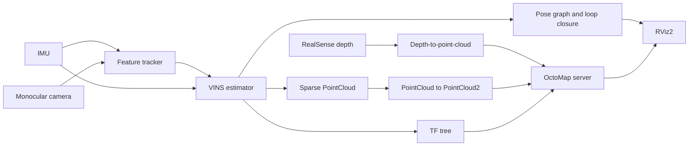

# Heterogeneous Robot Mapping Toolbox

A reproducible ROS 2 toolbox for visual-inertial odometry and 3D occupancy
mapping with aerial and ground robot sensor stacks. The repository assembles a
VINS-Mono ROS 2 integration, RealSense depth processing, TF alignment, point
cloud conversion, and OctoMap into one research workspace.

> **Research status:** This is a research artifact, not a production autonomy
> stack. The reference environment is Ubuntu 20.04 with ROS 2 Foxy, both of
> which are end-of-life. Use the pinned container workflow for reproduction and
> isolate it from safety-critical systems.

## Contribution and supervision

Kausar Patherya contributed to this toolbox as an independent researcher under
the supervision of **Prof. Lu Gan** and **Sandilya Sai Garimella**, PhD student,
in the Lunar Lab at Georgia Tech.

The contribution represented here is the systems integration and validation
layer around established open-source robotics packages:

- integrated visual-inertial SLAM components with ROS 2 Foxy;
- debugged dependency and TF-frame inconsistencies across the VIO and mapping
	pipeline;
- connected sparse and depth-derived point clouds to OctoMap-compatible ROS 2
	interfaces;
- configured RealSense-based room-scale reconstruction and visualization;
- validated visual-inertial trajectories against EuRoC sequences; and
- documented a repeatable workspace structure for follow-on research.

The repository does **not** implement semantic ICP or a complete decentralized
map-merging algorithm. Semantic initial alignment was a follow-on research
direction, not a result contained in this code. Upstream algorithms remain the
work of their respective authors; see [Provenance](docs/PROVENANCE.md).

## What is included

```text
.
├── .github/workflows/       Repository checks
├── docker/                  Pinned ROS 2 Foxy build environment
├── docs/                    Architecture, provenance, and reproduction notes
├── src/
│   ├── integrations/        Adapted VINS-Mono ROS 2 integration
│   ├── toolbox/             Small pipeline utilities
│   └── vendor/              Preserved upstream source snapshots
└── tools/                   Build and repository validation commands
```

The source tree remains below `src/`, so standard recursive package discovery
continues to work with `colcon`.

## Pipeline



See [Architecture](docs/ARCHITECTURE.md) for package boundaries, topics, and
known limitations.

## Quick start

### Native Ubuntu 20.04 / ROS 2 Foxy

```bash
git clone https://github.com/kpatherya/quad-ugv-mapping.git
cd quad-ugv-mapping
source /opt/ros/foxy/setup.bash
rosdep install --from-paths src --ignore-src --rosdistro foxy -r -y
./tools/build_workspace.sh mapping
source install/setup.bash
```

Run the EuRoC-oriented pipeline with a converted ROS 2 bag:

```bash
ros2 launch feature_tracker vins_feature_tracker.launch.py
ros2 launch vins_estimator euroc.launch.py
ros2 bag play /absolute/path/to/MH_01_easy
```

The launch file starts VINS-Mono, pose-graph optimization, TF publishers,
depth conversion, OctoMap, and RViz. Camera topic names and calibration must be
changed for hardware runs.

### Container

```bash
docker build --platform linux/amd64 -t heterogeneous-mapping:foxy -f docker/Dockerfile .
docker run --rm -it --platform linux/amd64 heterogeneous-mapping:foxy
```

On Apple Silicon, `linux/amd64` emulation improves compatibility with the Foxy
image but is not appropriate for performance measurements or camera access.

## Build profiles

```bash
./tools/build_workspace.sh converter   # PointCloud -> PointCloud2 utility
./tools/build_workspace.sh vio         # VINS-Mono ROS 2 packages
./tools/build_workspace.sh mapping     # VIO, converter, and OctoMap path
./tools/build_workspace.sh all         # Every discoverable package
```

Build artifacts are written to `build/`, `install/`, and `log/` and are ignored
by Git. Run `python3 tools/validate_repository.py` for a platform-independent
layout and metadata check.

## Reproducing the reported workflow

The shortest defensible reproduction target is a EuRoC VIO run, followed by a
RealSense/OctoMap hardware run:

1. Build the `vio` profile in the reference environment.
2. Download a EuRoC sequence and convert its ROS 1 bag using `rosbags`.
3. Launch the feature tracker and estimator, then play the converted bag.
4. Compare the estimated path with the supplied EuRoC ground-truth publisher.
5. For room reconstruction, calibrate the RealSense camera, verify the TF tree,
	 launch the `mapping` profile, and record the exact bag and parameters.

The repository does not redistribute datasets or claim benchmark scores that
are not committed as artifacts. Detailed controls and expected evidence are in
[Reproducibility](docs/REPRODUCIBILITY.md).

## Project boundaries

- `src/integrations/vins_mono_ros2` is an adapted snapshot of the ROS 2 port by
	Dongbo Shi, itself based on VINS-Mono and related projects.
- `src/toolbox/point_cloud_converter` is a small compatibility node used by the
	mapping pipeline; its historical package metadata requires provenance review
	before it should be presented as original authorship.
- `src/vendor` contains upstream snapshots for a self-contained historical
	build. New development should prefer pinned dependency manifests or released
	ROS packages where practical.
- RTAB-Map experiments described in the associated research work are not
	included in this snapshot.

## Citation

Use [CITATION.cff](CITATION.cff) to cite this toolbox. Academic use should also
cite VINS-Mono, OpenVINS, OctoMap, and other components actually used in an
experiment.

## License

Original toolbox documentation and automation are available under the BSD
3-Clause License. Included projects retain their own licenses, including GPLv3,
Apache-2.0, and BSD-family terms. There is no blanket relicensing of third-party
source; read [LICENSE](LICENSE) and [Provenance](docs/PROVENANCE.md) before
redistribution. Complete the [Release checklist](docs/RELEASE_CHECKLIST.md)
before changing repository visibility.

## Acknowledgments

This work was conducted under the supervision of Prof. Lu Gan, Director of the
Lunar Lab at Georgia Tech, with graduate mentorship from Sandilya Sai Garimella.
The toolbox builds on substantial work by the VINS-Mono, VINS-MONO-ROS2,
OpenVINS, OctoMap, Intel RealSense, PX4, and ROS vision communities.
